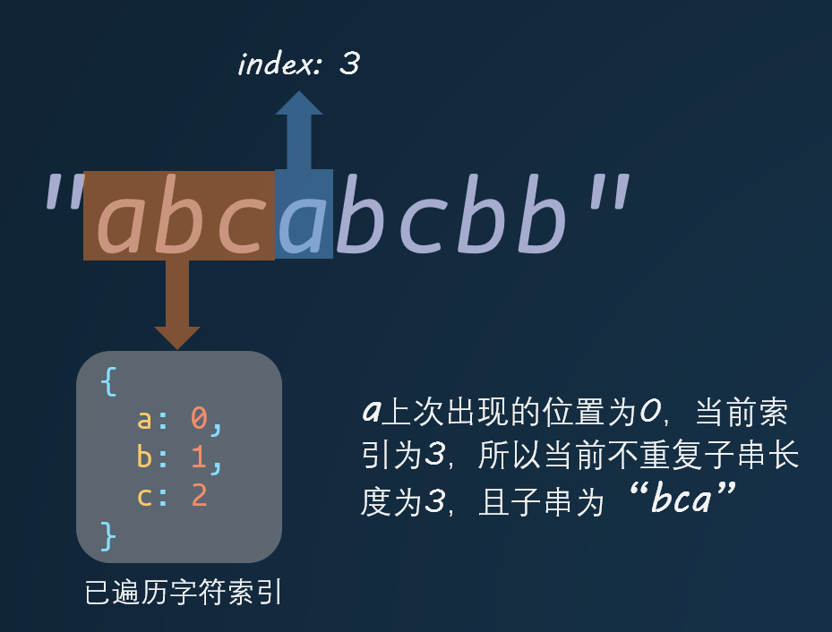
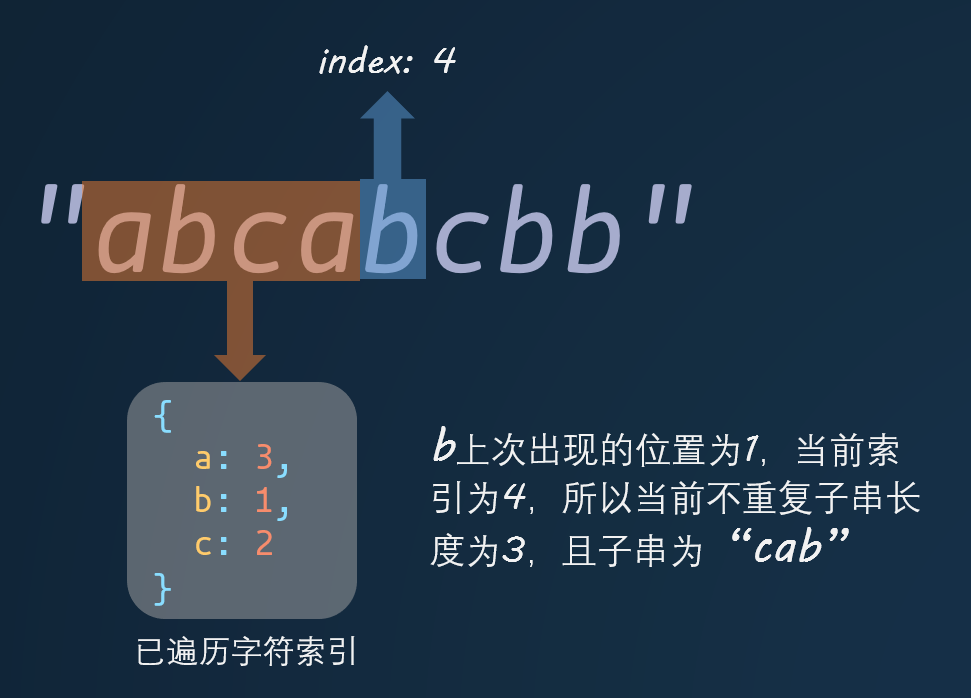

给定一个字符串，找出不含有重复字符的最长子串的长度。

#### 示例:

> 输入: "abcabcbb"

> 输出: 3

> 解释: 无重复字符的最长子串是 "abc"，其长度为 3。


要找到最长的不重复字符串，首先想到的就是要遍历这个字符串，每次拿到一个字符，就需要查询这个字符在前面是否出现过。那么每次我们还需要记录一个字符最近出现的位置，这样用当前位置减去这个字符最近出现的位置，就能得到一个不重复子串的长度，然后将这个数字存储到一个变量，每次用最新获取的长度与之前的长度进行对比，取最大值。

下面用两张图来进行说明：





具体代码如下：

```javascript
var lengthOfLongestSubstring = function(s) {
  const map = {} // 用于存储字符最近出现的索引
  let result = 0
  let len = s.length
  for (let i = 0; i < len; i++) {
    const str = s[i]
    const index = i + 1
    const start = map[str] || 0
    result = Math.max(result, index - start)
    map[str] = index // 记录字符索引
  }

  return result
}
```
