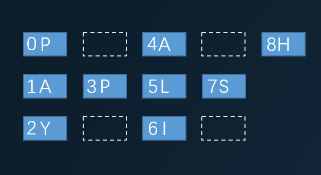
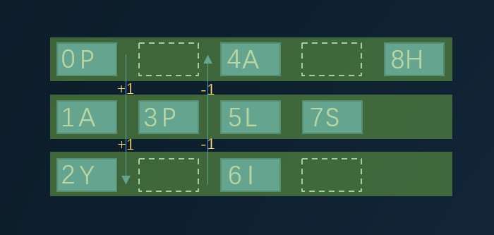

将字符串 "PAYPALISHIRING" 以Z字形排列成给定的行数：

```
P   A   H   N
A P L S I I G
Y   I   R
```

之后从左往右，逐行读取字符："PAHNAPLSIIGYIR"
实现一个将字符串进行指定行数变换的函数:

`string convert(string s, int numRows);`



### 方法一

根据上图各个字符还有索引，我们可以通过计算从左往右，得到所有字符在字符串中的索引。

这里会分两种情况讨论：

1. 第一行和最后一行；
2. 不属于上一种情况。

先看第一行，左上角的P(0)，它的索引为0，这个是毋庸置疑的。再看左边第二个A(4)，要得到它的索引其实也不难，首先A(4)前面有两列，然后因为是按照Z字排列，第二列必定有两个空位，所以可以得到A(4)的索引为当前的行数加上一个偏移量，这个偏移量为：`(2 * numRows − 2)`，numRows表示总行数。我们可以直接通过计算得到A(4)的索引为4。

```
0 + (2 * numRows − 2)
```

下面要得到H(8)的索引也是同样的道理，因为第一行的第三个字符，所以要加两次偏移量。知道得到的索引大于字符长度，就结束当前行。

再看看第二行，这一行因为不是第一行，所以会有**Z**字的中间部分，那么在每次加上(2 * Row − 2)之前，中间还有一个字符。比如从A(1)到L(5)，还需要加上P(3)。那么在循环中需要判断，当前行是否为第一行或者最后一行，如果不是，则需要加上中间字符。

具体代码如下：

```javascript
var convert = function (s, numRows) {
  const len = s.length
  if (numRows <= 1 || len <= numRows) {
    return s
  }
  let result = ''
  const cycleLen = 2 * numRows - 2 // 偏移量

  for (let i = 0; i < numRows; i++) {
    for (let j = 0; j + i < len; j += cycleLen) {
      result += s[j + i]
      // 判断是否为第一行或者最后一行，如果不是，插入中间字符
      if (i != 0 && i != numRows - 1 && j + cycleLen - i < len){
        // 中间字符的索引为下一个字符的偏移量，减去当前行数
        result += s[j + cycleLen - i]
      }
    }
  }
  return result
};
```


### 方法二



看上图，我们可以按照行数，先将字符划分成三个字符子串，然后从上往下，每次往一个子串中插入对应字符。这里我们需要一个偏移量，去计算当前行，是需要往下偏移还是往上偏移。

这里我们可以用变量`idx`记录当前行，然后用变量`step`表示偏移量，每次用`idx`加上`step`。
代码如下：

```javascript
// 用一个数组存储字符子串，创建一个长度为行数的数组，并且填充空字符
const result = new Array(numRows).fill('')
let idx = 0, step = 1
for (let i = 0; i < s.length; i++) {
  result[idx] += s[i] // 当前行的字符子串加上该索引的字符

  if (idx === s.length - 1) {
    // 如果当前行已经到了最后一行，偏移量变成负，向上偏移
    step = -1
  } else if (idx === 0) {
    // 如果当前行到了第0行，偏移量变成正，向下偏移
    step = 1
  }
  idx += step // 当前行向后偏移
}
```

这样我们通过偏移就得到一个数组，这个数组存储了每一行的字符子串，最后只需要把这个数组拼接成一个完整字符串，就能得到答案了。

完整代码如下：


```javascript
var convert = function (s, numRows) {
  const len = s.length
  if (numRows <= 1 || len <= numRows) {
    return s
  }
  const rowLen = numRows - 1
  const result = new Array(numRows).fill('')
  let idx = 0, step = 1
  for (let i = 0; i < len; i++) {
    result[idx] += s[i]
    if (idx === 0) {
      step = 1
    } else if (idx === rowLen) {
      step = -1
    }
    idx += step
  }
  return result.join('')
};
```
