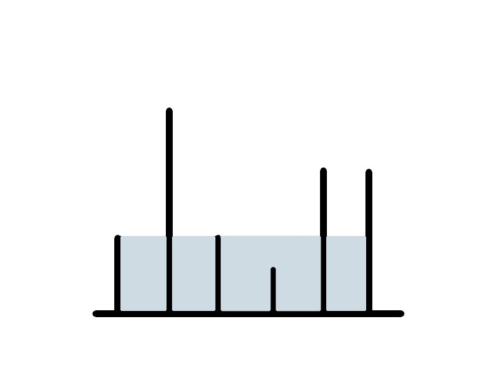

## 盛最多水的容器

给定 n 个非负整数 a1，a2，...，an，每个数代表坐标中的一个点 (i, ai) 。
在坐标内画 n 条垂直线，垂直线 i 的两个端点分别为 (i, ai) 和 (i, 0)。
找出其中的两条线，使得它们与 x 轴共同构成的容器可以容纳最多的水。

说明：你不能倾斜容器，且 n 的值至少为 2。

#### 示例:

> 输入: [1,8,6,2,5,4,8,3,7]

> 输出: 49


### 方法一：暴力法

这里最简单的方式就是暴力破解。通过两次嵌套的for循环，将所有情况遍历出来，然后取出最大值。

```javascript
var maxArea = function(height) {
  const length = height.length
  let max = 0
  for (let i = 0; i < length; i++) {
    for (let j = i + i; j < length; j++) {
      maxarea = Math.max(
        maxarea, 
        // 取出最短边，乘以底部长度，得到面积
        Math.min(height[i], height[j]) * (j - i)
      )
    }
  }
}
```

### 方法二：双指针法

要组成一个容器需要两块木板，这里假设我们初始的两块木板分别是0边和n边（n表示数组长度），假设0边小于n边，此时的容量为`n * height[0]`。因为0边是较短的一边，而且此时底部长度为最长，所有我们可确定此时是所有以0边为边的容器的最大容量。不理解的可以看下图仔细思考下，0边做为短边，无论其他的边有多长，只有和n边组合才是它的最大容量。



既然已经得到了0边的最大容量，现在0边向前移动，计算1边和n边的容量，此时的容量为`(n - 1) * height[n]`。再次假设1边是大于n边的，那么可以推测此时是所有以n边为边的容器的最大容量。这个时候会有个问题，0边和n边的容量不在这之内。因为之前已经计算了0边所有容器的最大容量，这就包括了0边与n边的容量。下面只有比较之前得到的0边容器最大容量，和n边容器最大容量，留下最大值。

接下来就只要移动指针，得出1边和n-1边的容量，与前面的最大容量比较。直到两边重合，既可求得最大容量。

具体解法如下：

```javascript
var maxArea = function(height) {
  let left = 0, right = height.length - 1
  let max = 0
  while (left < right) {
    const lh = height[left]
    const rh = height[right]
    max = Math.max(
      max,
      Math.min(lh, rh) * (right - left)
    )
    if (lh < rh) {
      left++
    } else if (rh < lh) {
      right--
    } else {
      left++
      right--
    }
  }
  return max
}
```